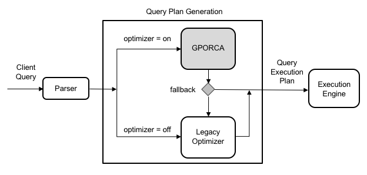

GPORCA extends the planning and optimization capabilities of the Postgres-based planner.GPORCA is extensible and achieves better optimization in multi-core architecture environments. Greenplum Database uses GPORCA by default to generate an execution plan for a query when possible.

GPORCA also enhances Greenplum Database query performance tuning in the following areas:

-   Queries against partitioned tables
-   Queries that contain a common table expression \(CTE\)
-   Queries that contain subqueries

In Greenplum Database, GPORCA co-exists with the Postgres-based planner. By default, Greenplum Database uses GPORCA. If GPORCA cannot be used, then the Postgres-based planner is used.

The following figure shows how GPORCA fits into the query planning architecture.

> **Note** All Postgres-based planner server configuration parameters are ignored by GPORCA. However, if Greenplum Database falls back to the Postgres-based planner, the planner server configuration parameters will impact the query plan generation. For a list of Postgres-based planner server configuration parameters, see [Query Tuning Parameters](../../../ref_guide/config_params/guc_category-list.html).

**Parent topic:** [About GPORCA](../../query/topics/query-piv-optimizer.html)

